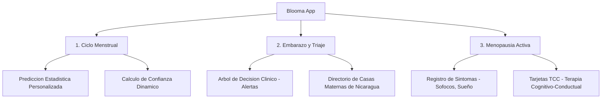
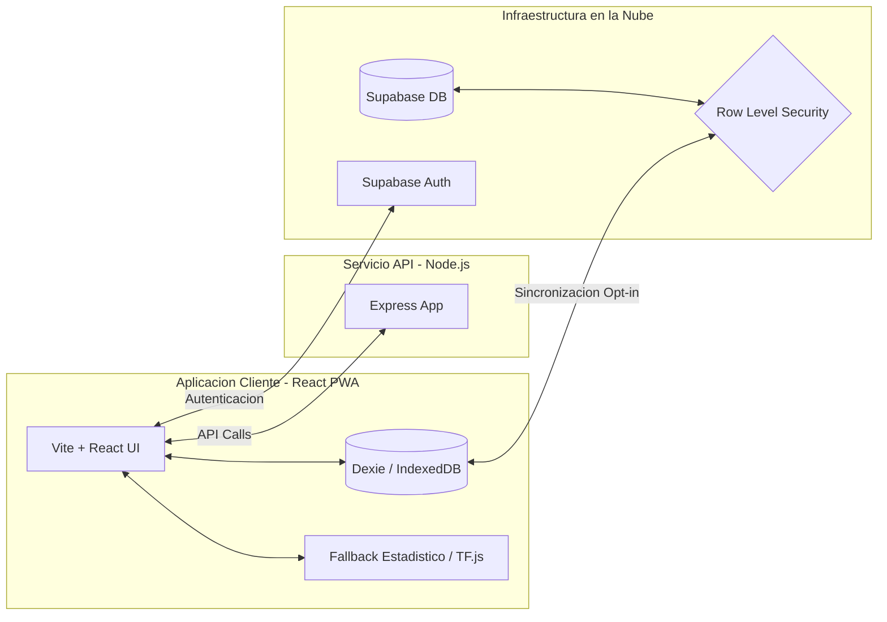

# Blooma - Acompañamiento Integral para la Mujer

[](https://hackathonicaragua.com.ni/)
[](#)
[](#)
[](#)

Blooma (del ingles "bloom": florecer, crecer, desarrollarse plenamente) es una aplicacion movil progresiva (PWA) diseñada para acompañar a las mujeres nicaragüenses en cada etapa de su vida reproductiva: ciclo menstrual, embarazo y menopausia.

---

## Ficha de Participacion - Hackathon Nicaragua 2026

Presentado en la 10ª Edicion del Festival Tecnologico y de Innovacion Abierta de Nicaragua: "10 años, Siempre mas alla".

| Informacion | Detalle |
| :--- | :--- |
| **Equipo** | **Git Push & Pray** |
| **Categoria** | Aficionado |
| **Tematica** | Salud - AF (Atencion Femenina) |
| **Reto** | App movil para el acompañamiento integral a mujeres |
| **Institucion** | Universidad Nacional de Ingeniería (UNI) — Managua |
| **Departamento** | Managua |

---

## Entregables del Primer Sprint - Evaluacion (31 de Julio, 2026)

De acuerdo con los requerimientos de la Guia del Primer Sprint de Evaluacion para Hackathon Nicaragua 2026, a continuacion se detallan los entregables correspondientes a Vision, Planeacion y Repositorio Inicializado.

### 1. Video Pitch de 1 Minuto
* **Descripcion**: Presentacion del reto de Acompañamiento Integral a Mujeres, la propuesta de solucion (Blooma) y la propuesta de valor del proyecto.
* **Enlace al Video (YouTube)**: [Enlace pendiente de carga por el equipo]

### 2. Tablero Kanban y Product Backlog
* **Descripcion**: Planificacion organizada y priorizada de las tareas por disciplina (UX/UI, Frontend, Backend, Producto), con asignacion de responsables y niveles de prioridad.
* **Enlace al Tablero**: [Enlace pendiente de carga por el equipo]

#### Resumen de Tareas del Product Backlog (Fase Inicial)

| Disciplina | Tarea / Entregable | Prioridad | Responsable | Estado |
| :--- | :--- | :--- | :--- | :--- |
| **Arquitectura** | Inicializacion del repositorio y estructuracion desacoplada | Alta | Git Push & Pray | Realizado |
| **Backend** | Configuracion inicial de Node.js, Express y dotenv | Alta | Programador Backend | Realizado |
| **Frontend** | Migracion de archivos del cliente React + Vite a la carpeta frontend | Alta | Programador Frontend | Realizado |
| **Producto** | Documentacion del Primer Sprint en el Repositorio (README) | Alta | Lider de Producto | Realizado |
| **Producto** | Creacion del Product Backlog en el Tablero Kanban | Alta | Lider de Producto | Realizado |
| **Diseño** | Elaboracion de Wireframes e interfaces de onboarding en Figma | Alta | Diseñador UX/UI | En proceso |
| **Producto** | Guion y grabacion del Video Pitch de 1 minuto | Alta | Lider de Producto | En proceso |
| **Frontend** | Implementacion de IndexedDB con Dexie para soporte offline | Alta | Programador Frontend | Pendiente |
| **Backend** | Configuracion de tablas de Supabase y politicas de seguridad RLS | Alta | Programador Backend | Pendiente |
| **Frontend** | Implementacion del algoritmo adaptativo de ciclo menstrual | Media | Programador Frontend | Pendiente |
| **Frontend** | Desarrollo del Módulo de Triaje de Embarazo | Media | Programador Frontend | Pendiente |
| **Backend** | Seed de base de datos con Directorio de Casas Maternas | Media | Programador Backend | Pendiente |
| **Diseño** | Diseño de interfaces del modulo de Menopausia | Baja | Diseñador UX/UI | Pendiente |

---

## Que es Blooma?

Frente a la oferta de aplicaciones FemTech tradicionales que asumen ciclos estandarizados o aplican diseños sobre-pinkificados, Blooma propone un espacio clinico neutro, seguro y privado. El sistema se adapta a la realidad fisiologia individual de cada usuaria mediante tres pilares:



---

## Caracteristicas Principales

### 1. Monitoreo de Ciclo Inteligente e Inclusivo
* **Algoritmo Adaptativo**: Blooma calcula la duracion del ciclo menstrual utilizando la mediana y la desviacion estandar de los datos reales de la usuaria, en lugar del metodo tradicional de 28 dias fijos.
* **Barra de Confianza**: Si el ciclo de la usuaria presenta alta variabilidad, el sistema lo indica claramente a traves de una barra de nivel de confianza.
* **Operacion Offline**: La app calcula y almacena los datos de forma local, funcionando al 100% sin conexion a internet.

### 2. Acompañamiento en Embarazo y Triaje Clinico
* **Arbol de Decision de Sintomas**: Clasificacion de signos de alerta en tres niveles (Normal, Vigilar, Urgente) para guiar de manera oportuna a la gestante.
* **Directorio de Casas Maternas**: Listado geolocalizado y categorizado por departamento con contactos directos de las Casas Maternas del MINSA para facilitar la canalizacion en emergencias.

### 3. Menopausia y Bienestar Integral
* **Educacion Activa**: Enfoque de prevencion de osteoporosis y recordatorio de chequeos de densidad osea.
* **Apoyo Emocional**: Modulo interactivo de Terapia Cognitivo-Conductual (TCC) orientado a mitigar el impacto de sofocos, ansiedad y trastornos del sueño.

---

## Privacidad y Seguridad por Diseño (Privacy by Design)

Para resolver las vulnerabilidades de privacidad asociadas con el almacenamiento centralizado de datos intimos, Blooma incorpora las siguientes directrices de seguridad:

1. **Arquitectura Local-First**: Los datos clinicos y de sintomatologia se guardan localmente en el dispositivo utilizando Dexie (IndexedDB). La sincronizacion con el backend en la nube es opcional (opt-in).
2. **Modo Sigiloso (Proteccion contra Violencia de Pareja - IPV)**:
   * Acceso protegido obligatorio mediante PIN de 4 digitos o biometria.
   * **Notificaciones Discretas**: Alertas en pantalla de bloqueo redactadas de forma neutra ("Tienes una actualizacion en Blooma") para evitar la exposicion de datos sensibles.
   * Icono y nombre de la aplicacion configurables por el usuario para camuflar el acceso en la pantalla de inicio.
3. **Eliminacion de Datos Real**: La opcion "Eliminar mi cuenta" ejecuta un borrado en cascada inmediato tanto en el almacenamiento local como en el backend, garantizando que no se retengan registros de la usuaria.
4. **Seguridad Tecnica**: Proteccion de tablas de base de datos mediante politicas de Row Level Security (RLS) en Supabase, limitando el acceso de lectura y escritura unicamente al usuario autenticado.

---

## Arquitectura del Sistema

El proyecto esta organizado en una estructura desacoplada para facilitar el desarrollo independiente de cada componente:



---

## Estructura del Codigo y Como Empezar

El repositorio esta dividido en dos directorios principales:
```
Proyecto-Blooma/
├── frontend/     # Codigo del cliente (React + Vite + TS)
└── backend/      # API del servidor (Node.js + Express)
```

### Arrancar el Frontend

1. Dirigete a la carpeta correspondiente:
   ```bash
   cd frontend
   ```
2. Instalar las dependencias del proyecto:
   ```bash
   npm install
   ```
3. Ejecutar en modo desarrollo:
   ```bash
   npm run dev
   ```

### Arrancar el Backend

1. Dirigete a la carpeta correspondiente:
   ```bash
   cd backend
   ```
2. Instalar las dependencias del servidor:
   ```bash
   npm install
   ```
3. Duplicar el archivo de configuración de variables de entorno y ajustarlo:
   ```bash
   cp .env.example .env
   ```
4. Ejecutar en modo desarrollo:
   ```bash
   npm run dev
   ```