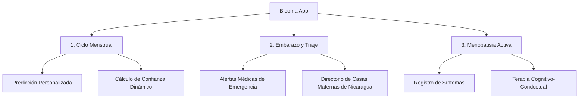

# Blooma - Acompañamiento Integral para la Mujer

[](https://hackathonicaragua.com.ni/)
[](#)
[](#)
[](#)

Blooma (del inglés "bloom": florecer, crecer, desarrollarse plenamente) es una aplicación móvil progresiva (PWA) diseñada para acompañar a las mujeres en las tres etapas clave de su vida reproductiva: ciclo menstrual, embarazo y menopausia.

A diferencia de las aplicaciones tradicionales, Blooma funciona 100% sin necesidad de internet, protege la privacidad de la información en el dispositivo y se adapta al cuerpo de cada mujer mediante estimaciones personalizadas y alertas médicas conectadas con la red de Casas Maternas del MINSA.

### Aplicación en Producción:
El sistema se encuentra desplegado y disponible públicamente en Vercel a través del siguiente enlace:  
[https://proyecto-blooma.vercel.app/](https://proyecto-blooma.vercel.app/)

---

## Ficha de Participación - Hackathon Nicaragua 2026

Presentado en la 10ª Edición del Festival Tecnológico y de Innovación Abierta de Nicaragua: "10 años, Siempre más allá".

| Información | Detalle |
| :--- | :--- |
| **Equipo** | **Git Push & Pray** |
| **Categoría** | Aficionado |
| **Temática** | Salud - AF (Atención Femenina) |
| **Reto** | App móvil para el acompañamiento integral a mujeres |
| **Institución** | Universidad Nacional de Ingeniería (UNI) — Managua |
| **Departamento** | Managua |

### Integrantes del Equipo

| Integrante | Rol |
| :--- | :--- |
| **ETHEL YASSIRYS SUAREZ ESPINOZA** | Diseñador (UI/UX) |
| **ISAAC ANTONIO ESPINOZA SAENZ** | Desarrollador (Frontend / PWA) |
| **GERMAN EMANUEL GONZALEZ ROSTRAN** | Desarrollador (Backend / Base de Datos) |
| **KEVIN GAEL TORREZ URBINA** | Comunicador (Pitch / Presentación) |
| **MIGUEL ANGEL TORRES GUADAMUZ** | Mercadólogo (Estrategia / Producto) |

---

## Credenciales para Evaluadores del Hackathon

De acuerdo a las instrucciones oficiales del Primer Sprint de Evaluación, se ha generado el siguiente usuario exclusivo de prueba para el comité evaluador:

* **Correo de Prueba**: `evaluadorhack@gmail.com`
* **Contraseña de Prueba**: `HN26_Evaluador2026!`
* **Acceso Otorgado**: Repositorio en Git, Tablero de Trabajo y entorno de pruebas en la aplicación web.

---

## Entregables del Primer Sprint - Evaluación (31 de Julio, 2026)

De acuerdo con los requerimientos del Primer Sprint de Evaluación para Hackathon Nicaragua 2026, a continuación se detallan los entregables correspondientes a Visión, Planeación y Repositorio Inicializado.

### 1. Video Pitch de 1 Minuto
Presentación sintética de 60 segundos configurada en modo Oculto en YouTube, exponiendo la problemática atendida, la arquitectura tecnológica y la propuesta de valor del sistema, contando con la participación del integrante designado como presentador (Kevin Gael Torrez Urbina).

* **Enlace al Video (YouTube)**: [Ver Video Pitch de 1 Minuto](https://www.youtube.com/watch?v=XXXXXXXXXXX)

### 2. Tablero de Trabajo y Product Backlog
Organización secuencial de entregables y tareas distribuidas entre las distintas disciplinas del equipo.

* **Enlace al Tablero de GitHub Projects**: [Tablero Kanban - Proyecto Blooma](https://github.com/users/Espinoza08-iaes/projects/2)

#### Estado de Avance de las Tareas del Product Backlog

| Tarea / Entregable | Disciplina | Prioridad | Responsable | Fecha Límite | Estado |
| :--- | :--- | :--- | :--- | :--- | :--- |
| Inicialización del Repositorio y Arquitectura Desacoplada | Arquitectura | Alta | Isaac Espinoza | 26/07/2026 | Realizado |
| Configuración de Node.js, Express y Supabase RLS | Backend | Alta | German González | 27/07/2026 | Realizado |
| Migración de Archivos React + Vite a PWA | Frontend | Alta | Isaac Espinoza | 27/07/2026 | Realizado |
| Wireframes y Guía de Estilos Visuales en Figma | UI/UX | Alta | Ethel Suárez | 28/07/2026 | Realizado |
| Implementación de IndexedDB (Dexie) para Operación Offline | Frontend | Alta | Isaac Espinoza | 28/07/2026 | Realizado |
| Directorio de Casas Maternas de Nicaragua MINSA | Backend | Media | German González | 28/07/2026 | Realizado |
| Documentación README y Credenciales de Evaluación | Producto | Alta | Miguel Torres | 29/07/2026 | Realizado |
| Grabación y Edición del Video Pitch de 1 Minuto | Comunicación | Alta | Kevin Torrez | 29/07/2026 | En proceso |
| Estrategia de Producto y Plan de Marketing | Mercadeo | Media | Miguel Torres | 30/07/2026 | En proceso |
| Validación de Accesibilidad y 4 Temas Visuales | UI/UX | Media | Ethel Suárez | 30/07/2026 | Realizado |
| Envío del Formulario Oficial del Sprint 1 | Liderazgo | Alta | Kevin Torrez | 30/07/2026 | En proceso |

---

## Visión General de Blooma

Frente a las aplicaciones tradicionales que aplican esquemas rígidos, Blooma propone un entorno sencillo, seguro y privado. El sistema se adapta a la fisiología individual de cada usuaria mediante tres pilares:


```mermaid
graph TD
    A[Blooma App] --> B[1. Ciclo Menstrual]
    A --> C[2. Embarazo y Triaje]
    A --> D[3. Menopausia Activa]
    
    B --> B1[Predicción Personalizada]
    B --> B2[Cálculo de Confianza Dinámico]
    
    C --> C1[Alertas Médicas de Emergencia]
    C --> C2[Directorio de Casas Maternas de Nicaragua]
    
    D --> D1[Registro de Síntomas]
    D --> D2[Terapia Cognitivo-Conductual]
```

---

## Características Principales

### 1. Monitoreo de Ciclo Adaptativo
* **Algoritmo Estadístico**: Blooma calcula la duración del ciclo menstrual utilizando los datos reales de la usuaria en lugar de un período fijo de 28 días.
* **Nivel de Confianza**: Indica la variabilidad del ciclo para evitar estimaciones imprecisas.
* **Operación Offline**: Funciona al 100% sin conexión a internet.

### 2. Acompañamiento en Embarazo y Triaje Clínico
* **Árbol de Decisión de Síntomas**: Clasificación de signos de alerta en tres niveles (Normal, Vigilar, Urgente).
* **Directorio de Casas Maternas**: Listado geolocalizado con información de contacto directa de las Casas Maternas del MINSA.

### 3. Menopausia y Bienestar Integral
* **Educación Preventiva**: Módulo enfocado en prevención y salud ósea.
* **Apoyo Emocional**: Herramienta interactiva para la gestión de sofocos y ansiedad.

### 4. Interfaz Adaptativa y Personalización
* **Distribución en Pantallas Grandes**: Estructura de tres columnas para vistas de escritorio.
* **Personalización Visual**: Cuatro paletas de colores neutras y control de accesibilidad tipográfica.

---

## Privacidad y Seguridad por Diseño

1. **Almacenamiento Local**: Los datos se guardan directamente en el dispositivo. La sincronización en la nube es opcional.
2. **Modo Sigiloso**: Acceso protegido por PIN de 4 dígitos y notificaciones discretas.
3. **Eliminación Efectiva**: Borrado inmediato de datos al solicitar la eliminación de cuenta.

---

## Estructura del Código y Ejecución

```
Proyecto-Blooma/
├── frontend/     # Aplicación Cliente (React + Vite + TypeScript)
├── backend/      # API del Servidor (Node.js + Express + Supabase)
└── docs/         # Documentación Técnica, esquemas y CSV de tareas
```

### Ejecución del Frontend
```bash
cd frontend
npm install
npm run dev
```

### Ejecución del Backend
```bash
cd backend
npm install
cp .env.example .env
npm run dev
```