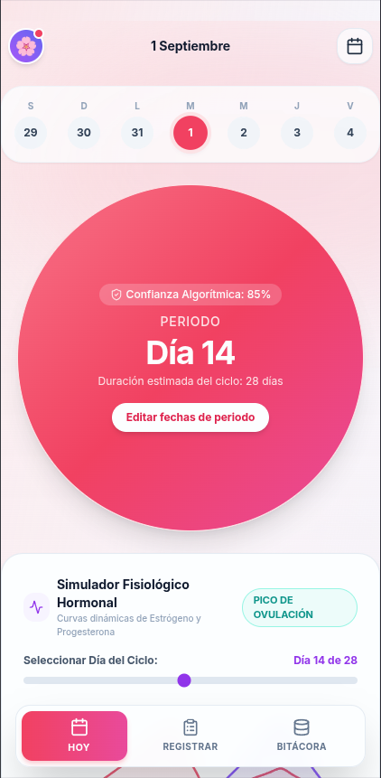
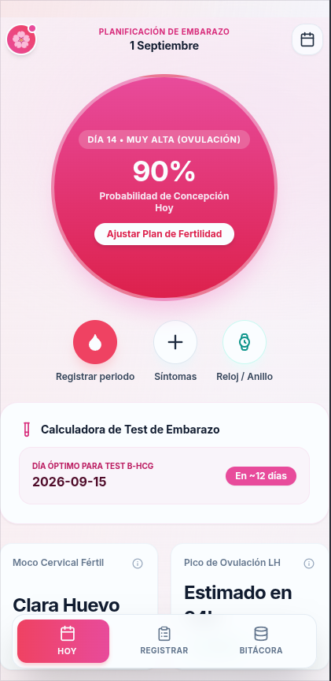
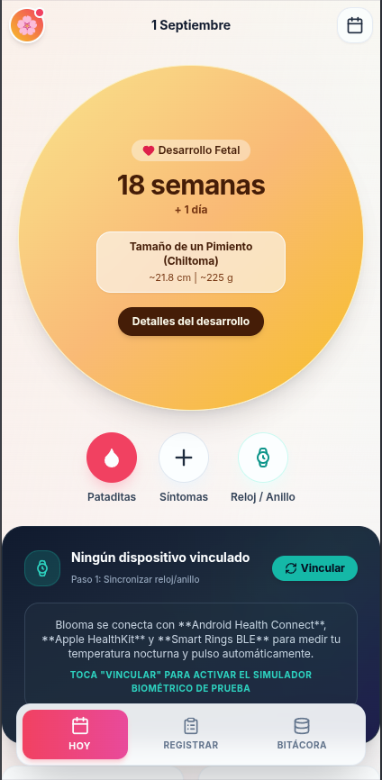
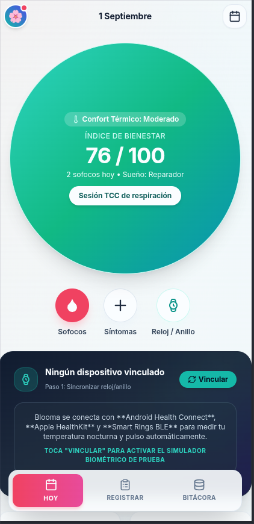
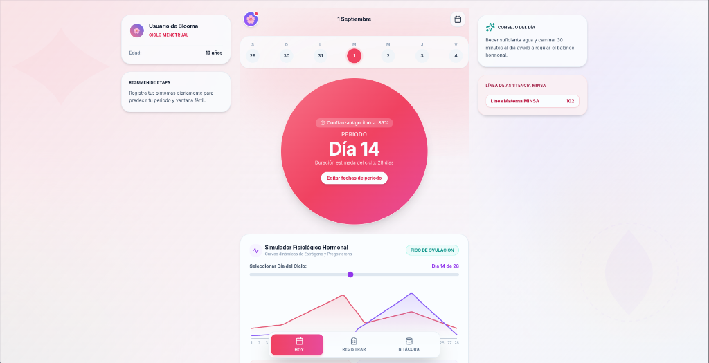
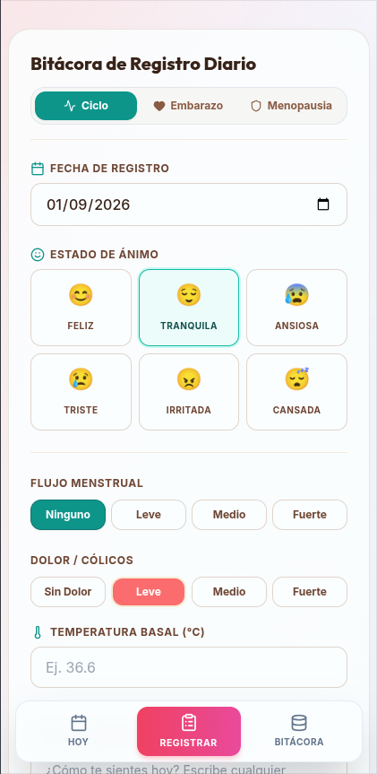
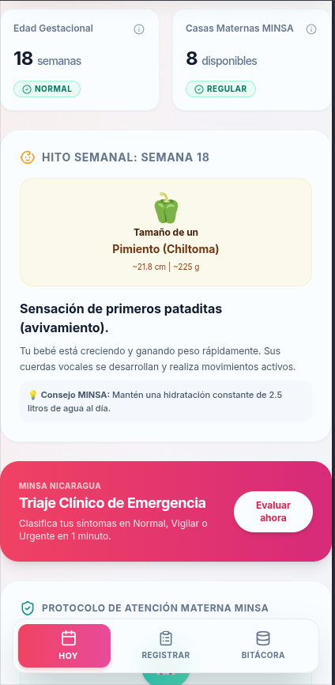
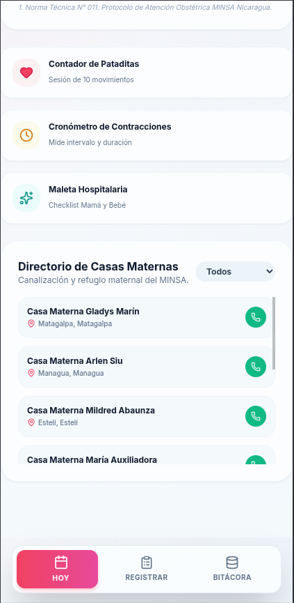
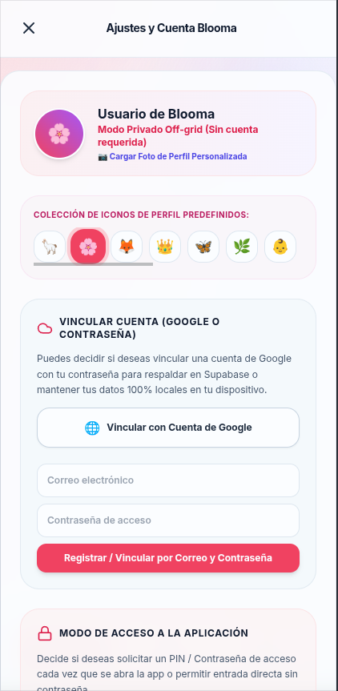
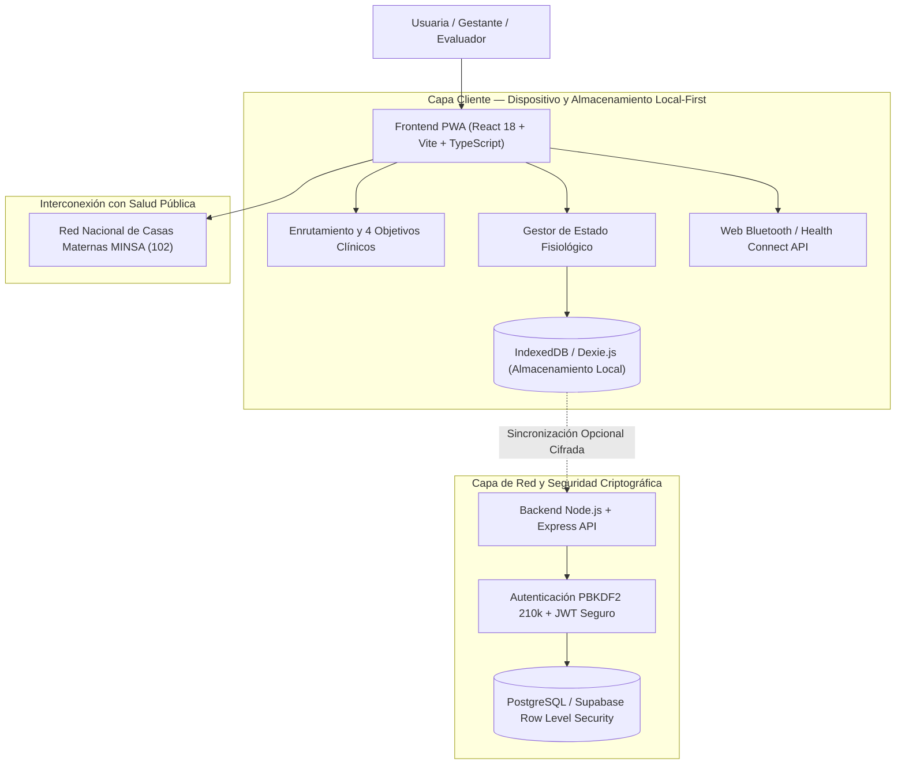

<p align="center">
  
</p>

<p align="center">
  <strong>Ecosistema Progresivo de Salud Femenina y Acompañamiento Integral</strong><br>
  <em>10ª Edición Hackathon Nicaragua 2026 — "10 años, Siempre más allá"</em>
</p>

<p align="center">
  <a href="https://hackathonicaragua.com.ni/"></a>
  
  
  <a href="https://proyecto-blooma.vercel.app/" target="_blank" rel="noopener noreferrer"></a>
  
</p>

---

## 1. Resumen Ejecutivo del Proyecto

**Blooma** (del término en inglés *"bloom"*: florecer y desarrollarse plenamente) es una Aplicación Web Progresiva (PWA) de salud femenina concebida bajo el paradigma **Local-First** y diseñada para **todas las mujeres de Nicaragua sin distinción de origen, etnia, nivel de conectividad o lengua materna**. 

El sistema opera **100% desconectado de internet**, garantiza privacidad absoluta al no depender de servidores centralizados para el uso diario, e incorpora **inclusión lingüística territorial nativa** (*Español Comunitario*, *Miskitu* de la RACCN e *Inglés Criollo / Creole* de la RACCS), **geolocalización y cálculo de proximidad Haversine 100% offline** hacia la red de **Casas Maternas y Hospitales de Referencia con Quirófano / Código Rojo del Ministerio de Salud (MINSA)**, y un seguimiento clínico integral que abarca desde la menarquía hasta la postmenopausia avanzada.

---

## 2. Los 4 Objetivos Clínicos Especializados

A diferencia de las herramientas convencionales de ciclo fijo, Blooma adapta su modelo predictivo a 4 necesidades de salud diferenciadas:

| 1. Seguir mi Ciclo | 2. Planificar Embarazo | 3. Monitorear Embarazo | 4. Gestionar Menopausia |
| :---: | :---: | :---: | :---: |
|  |  |  |  |
| **Monitoreo Adaptativo**<br>Cálculo de confianza algorítmica (85%) y curvas hormonales. | **Ventana de Concepción**<br>Probabilidad diaria (90%), test B-hCG y moco fértil. | **Salud Gestacional**<br>Semana 18, Plan de Parto MINSA, pataditas y Casas Maternas. | **Climaterio STRAW+10**<br>5 Fases clínicas, Escala MRS OMS, sofocos y TCC. |

---

## 3. Inclusión Territorial Multi-Étnica y Universalidad

Nicaragua es un país multiétnico, multilingüe e intercultural. Blooma elimina las barreras idiomáticas y de conectividad mediante:
* **Traducción Nativa en 3 Lenguas Territoriales**:
  * **Español Nacional / Comunitario**: Lenguaje accesible adaptado a la terminología cotidiana del país.
  * **Miskitu (*Miskitu Yapu*)**: Cobertura prioritaria para las comunidades de la Costa Caribe Norte (RACCN), Río Coco, Waspam y Bilwi.
  * **Nicaraguan Creole English**: Cobertura para la Costa Caribe Sur (RACCS), Bluefields, Laguna de Perlas y Corn Island.
* **Alertas Obstétricas en Lengua Originaria**: Señales de peligro (*Tala takan / Sangrado*, *Duku saura / Cefalea severa*, *Tawan / Fiebre alta*, *Kuhbi aukan apu / Disminución de pataditas*) traducidas para una reacción comunitaria inmediata.
* **Geolocalización Haversine 100% Offline**: Cálculo instantáneo en kilómetros y metros hacia los 25 hospitales departamentales y Casas Maternas (*Upla Nani Baiki Sakanka*) sin requerir saldo ni paquetes de datos.

---

## 3. Acceso al Entorno en Producción y Credenciales

* **Aplicación Web en Producción (Vercel Edge):** <a href="https://proyecto-blooma.vercel.app/" target="_blank" rel="noopener noreferrer">https://proyecto-blooma.vercel.app/</a>
* **Video Pitch Oficial (60 Segundos):** <a href="https://youtube.com/shorts/qLHfupRCO-Q?si=O0pgQD1246XFiipS" target="_blank" rel="noopener noreferrer">Ver en YouTube Shorts</a>
* **Tablero de Trabajo Kanban:** <a href="https://github.com/users/Espinoza08-iaes/projects/2" target="_blank" rel="noopener noreferrer">GitHub Projects - Proyecto Blooma</a>
* **Credenciales de Demostración para Evaluadores:**
  * Usuario de prueba: `evaluadorhack@gmail.com`
  * Contraseña de prueba: `HN26_Evaluador2026!`
  * Modalidad de Acceso: Entrada libre en **Modo Privado Off-Grid** o mediante inicio de sesión.

---

## 4. Galería de Interfaz y Experiencia de Usuario (PWA)

<p align="center">
  
  <br>
  <em>Vista de escritorio: Simulador fisiológico de estrógeno/progesterona y canalización directa MINSA 102.</em>
</p>

| Bitácora de Registro Diario | Triaje Clínico de Emergencia | Directorio de Casas Maternas | Ajustes y PIN de Seguridad |
| :---: | :---: | :---: | :---: |
|  |  |  |  |
| Registro visual de estados de ánimo, flujo y temperatura. | Evaluación de signos de peligro según Norma Técnica Nº 011. | Listado geolocalizado departamental con llamada directa. | Modo discreto anti-estigma y bloqueo por PIN de 4 dígitos. |

---

## 5. Ficha Técnica Institucional — Hackathon Nicaragua 2026

| Parámetro Oficial | Detalle |
| :--- | :--- |
| **Nombre del Proyecto** | Blooma (Salud Femenina y Acompañamiento Integral) |
| **Equipo Representante** | **Git Push & Pray** |
| **Categoría** | Aficionado |
| **Temática Oficial** | Salud - AF (Atención Femenina) |
| **Institución Académica** | Universidad Nacional de Ingeniería (UNI) — Sede Managua |
| **Licencia de Código** | Código Abierto bajo Licencia MIT |

### Integrantes y Asignación por Disciplina

| Integrante | Rol Asignado | Disciplina Responsable |
| :--- | :--- | :--- |
| **ISAAC ANTONIO ESPINOZA SAENZ** | Desarrollador Principal | Arquitectura de Software & Frontend PWA |
| **GERMAN EMANUEL GONZALEZ ROSTRAN** | Desarrollador Backend | API REST, Base de Datos & Ciberseguridad |
| **ETHEL YASSIRYS SUAREZ ESPINOZA** | Diseñadora UI / UX | Identidad Visual, UI/UX & Accesibilidad WCAG |
| **MIGUEL ANGEL TORRES GUADAMUZ** | Estratega de Producto | Modelo de Negocio, Finanzas & Marketing |
| **KEVIN GAEL TORREZ URBINA** | Comunicador | Comunicación Estratégica, Pitch & Storytelling |

---

## 6. Arquitectura de Software y Seguridad Criptográfica


```mermaid
graph TD
    User["Usuaria / Gestante / Evaluador"] --> PWA["Frontend PWA (React 18 + Vite + TypeScript)"]
    
    subgraph CapaCliente ["Capa Cliente — Dispositivo y Almacenamiento Local-First"]
        PWA --> Router["Enrutamiento y 4 Objetivos Clínicos"]
        PWA --> UIState["Gestor de Estado Fisiológico"]
        UIState --> LocalDB[("IndexedDB / Dexie.js (Almacenamiento Local)")]
        PWA --> BLE["Web Bluetooth / Health Connect API"]
    end
    
    subgraph CapaSeguridad ["Capa de Red y Seguridad Criptográfica"]
        LocalDB -.->|"Sincronización Opcional Cifrada"| API["Backend Node.js + Express API"]
        API --> AuthGuard["Autenticación PBKDF2 210k + JWT Seguro"]
        AuthGuard --> CloudDB[("PostgreSQL / Supabase Row Level Security")]
    end
    
    subgraph CapaComunitaria ["Interconexión con Salud Pública"]
        PWA --> MINSA["Red Nacional de Casas Maternas MINSA (102)"]
    end
```

### Innovaciones Técnicas y de Impacto Comunitario
1. **Inclusión Lingüística Multi-Étnica:** Soporte nativo para *Miskitu* (RACCN), *Creole English* (RACCS) y *Español Comunitario*, democratizando el acceso a la salud materna para toda mujer nicaragüense sin distinción geográfica ni cultural.
2. **Geolocalización Haversine 100% Offline:** Cálculo instantáneo de proximidad a Casas Maternas (*Upla Nani Baiki Sakanka*) y Hospitales con Quirófano Obstétrico activo 24h en los 15 departamentos y 2 regiones autónomas, sin consumir datos móviles.
3. **Local-First por Defecto:** Los datos sensibles residen exclusivamente en el dispositivo mediante IndexedDB y Dexie.js (versión 5). La sincronización a la nube (Supabase PostgreSQL RLS) es 100% voluntaria y cifrada.
4. **Triaje Obstétrico y Plan de Parto Familiar Comunitario (MINSA):** Alerta preventiva en la Semana 32 (8° mes), evaluación de señales de peligro (Código Rojo/Amarillo) y logística de traslado seguro (ambulancia, panga, carreta, vehículo).
5. **Profundidad Clínica en Climaterio (STRAW+10 y Escala MRS):** Superación del modelo binario mediante 5 etapas fisiológicas del climaterio y test estandarizado de la OMS (somático, psicológico y urogenital).
6. **Telemetría de Reloj y Anillo Inteligente (Wearable Sync):** Integración con sensores corporales por Web Bluetooth / Health Connect para lectura nocturna de temperatura basal, pulso en reposo y HRV.
7. **Privacidad contra Violencia Digital (IPV):** Acceso protegido por PIN de 4 dígitos, modo discreto con camuflaje de términos y borrado seguro de datos en cascada.
8. **Simulador Fisiológico Hormonal:** Representación matemática interactiva de las curvas de estrógeno y progesterona a lo largo del ciclo.

---

## 7. Dossier Oficial de Entregables (`entregables_hackathon/`)

La carpeta [entregables_hackathon/](entregables_hackathon/) contiene la documentación técnica, gráfica y estratégica clasificada por áreas de trabajo:

* **01_desarrollo/**
  * `01_README_TECNICO_Y_ENDPOINTS.md` — Arquitectura desacoplada, catálogo de endpoints REST y variables.
  * `02_DIAGRAMA_ER_3FN.md` — Diagrama Entidad-Relación normalizado en 3FN y diccionario de datos.
  * `03_DIAGRAMAS_UML.md` — Diagramas UML de Casos de Uso, Actividades y Clases.
  * `04_FLUJO_GIT_Y_CONVENCIONES.md` — Metodología GitFlow y Conventional Commits.
  * `05_SEGURIDAD_Y_DESPLIEGUE.md` — Políticas RLS, PBKDF2 (210k iteraciones) y verificación Vercel.
* **02_diseno_grafico/**
  * `logos/` — Logotipos vectoriales SVG (principal, horizontal, isotipo, monocromático).
  * `01_MANUAL_DE_IDENTIDAD.md` — ADN de marca, área de reserva y retícula de construcción.
  * `02_FICHA_TECNICA_COLOR_WCAG.md` — Códigos HEX, RGB, CMYK y matrices de contraste WCAG AA.
  * `03_SISTEMA_TIPOGRAFICO.md` — Jerarquía Outfit/Inter y escala tipográfica responsive.
  * `04_MOODBOARD_Y_VALORES.md` — Brief creativo, valores y arquetipos de marca.
  * `05_UX_WIREFRAMES_Y_MOCKUPS.md` — Arquitectura de información y especificación de interfaz.
* **03_marketing_y_negocios/**
  * `01_BUSINESS_MODEL_CANVAS.md` — Matriz de 9 bloques de modelo de negocio e impacto social.
  * `02_BUYER_PERSONAS_Y_EMPATIA.md` — Perfiles psicográficos y mapas de empatía.
  * `03_PLAN_BRANDING_Y_ARQUETIPOS.md` — Posicionamiento de marca (El Cuidador y El Sabio).
  * `04_PROPUESTA_VALOR_Y_CANALES.md` — Value Proposition Canvas y canales digitales/comunitarios.
  * `05_OBJETIVOS_SMART_CRONOGRAMA.md` — 4 Metas SMART cuantificables y diagrama de Gantt.
  * `06_PLAN_FINANCIERO_PRESUPUESTO.md` — Estructura de costos, presupuesto y sostenibilidad B2G.
* **pdf/ (Dossier Oficial Clasificado por las 3 Disciplinas)**
  * **01_desarrollo/**
    * `01_DOSSIER_TECNICO_Y_ARQUITECTURA.pdf` — Arquitectura de software, diagramas y endpoints.
    * `DOSSIER_GENERAL_HACKATHON_BLOOMA_2026.pdf` — Documento Maestro Integral de todas las disciplinas.
    * `DECLARACION_USO_RESPONSABLE_IA_HACKATHON_2026.pdf` — Formulario oficial de ética y transparencia IA.
  * **02_diseno_grafico/**
    * `02_MANUAL_DE_IDENTIDAD_Y_FICHAS_GRAFICAS.pdf` — Manual de Marca oficial en alta definición (12 MB).
    * `PLANTILLA_FICHA_COLOR_Y_ACCESIBILIDAD_WCAG.pdf` — Ficha de paletas y matrices de contraste WCAG AA.
  * **03_marketing_y_negocios/**
    * `03_PLAN_DE_NEGOCIO_Y_MARKETING.pdf` — Plan integral de producto y comercialización B2G.
    * `PLANTILLA_BUSINESS_MODEL_CANVAS.pdf` — Matriz Lean Canvas de 9 bloques.
    * `PLANTILLA_BUYER_PERSONAS_Y_EMPATIA.pdf` — Perfiles de usuarias y mapas de empatía.
    * `PLANTILLA_OBJETIVOS_SMART_Y_CRONOGRAMA.pdf` — 4 Metas SMART y diagrama de tiempos.
    * `PLANTILLA_PLAN_FINANCIERO_Y_PRESUPUESTO.pdf` — Estructura de costos y presupuesto.

---

## 8. Estructura del Repositorio

```
Proyecto-Blooma/
├── frontend/                  # Aplicación Cliente PWA (React 18, Vite, TypeScript, IndexedDB)
│   ├── src/
│   │   ├── components/        # Componentes UI (HeroDial, WearableSyncCard, ProfileSettingsDrawer)
│   │   ├── db/                # Clientes IndexedDB (Dexie) y Supabase
│   │   └── types/             # Definiciones de tipos TypeScript
│   └── public/                # Manifiesto PWA, iconos e imágenes estáticas
│
├── backend/                   # API REST y Microservicios (Node.js, Express, Criptografía OWASP)
│   ├── src/
│   │   ├── routes/            # Rutas de Autenticación, Salud y Directorio MINSA
│   │   ├── auth.js            # Middleware de Seguridad y Verificación de Tokens
│   │   └── index.js           # Punto de Entrada del Servidor
│   └── .env.example           # Plantilla de Variables de Entorno Segura
│
├── entregables_hackathon/     # Dossier Oficial de Entregables Hackathon 2026
│   ├── 01_desarrollo/         # Documentos Técnicos y Diagramas
│   ├── 02_diseno_grafico/     # Manual de Identidad, Logos SVG y Paletas WCAG
│   ├── 03_marketing_y_negocios/ # Canvas, Personas, Estrategia y Finanzas
│   ├── assets/                # Galería de 23 Capturas Reales de la Interfaz
│   ├── pdf/                   # 10 Documentos y Plantillas en PDF para Evaluación
│   └── README.md              # Portada y Mapa de Navegación del Dossier
│
└── README.md                  # Presentación Oficial del Proyecto
```

---

## 9. Guía de Instalación y Ejecución Local

### Prerrequisitos
* Node.js v18.0.0 o superior
* npm v9.0.0 o superior

### 1. Clonar el Repositorio
```bash
git clone https://github.com/Espinoza08-iaes/Proyecto-Blooma.git
cd Proyecto-Blooma
```

### 2. Levantar el Frontend (PWA)
```bash
cd frontend
npm install
npm run dev
```
Disponible localmente en `http://localhost:5173`.

### 3. Levantar el Backend (API)
```bash
cd ../backend
npm install
cp .env.example .env
npm run dev
```
El servidor backend escuchará en `http://localhost:3000`.

---

## 10. Licencia

Este proyecto está bajo la Licencia MIT. Consulte el archivo correspondiente para mayor información.
