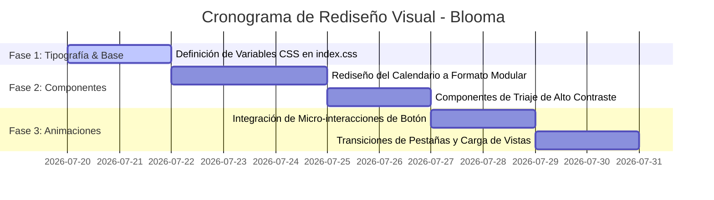

# Plan de Rediseño Visual y UI/UX - Proyecto Blooma

Este plan estratégico detalla las mejoras, tendencias y pasos técnicos para llevar el apartado visual de Blooma al siguiente nivel, inspirándonos en las mejores prácticas de la industria de la salud digital (FemTech).

---

## 1. Análisis de Competidores y Adaptación de Patrones Exitosos

Investigamos las interfaces de las tres aplicaciones líderes del mercado para extraer e incorporar los elementos que mejor funcionan:

### A. Clue (Enfoque Científico y Geométrico)
* **Lo que funciona**: Clue se aleja del diseño convencional. Utiliza una representación del ciclo circular (rueda menstrual) en lugar de un calendario tradicional, lo que reduce la carga cognitiva y muestra el tiempo de manera cíclica.
* **Adaptación para Blooma**: 
  * Reemplazar las tablas estáticas en la sección de estadísticas por un gráfico de ciclo circular interactivo, dibujado mediante SVG dinámicos que representen las fases (folicular, ovulatoria, lútea, menstrual) con curvas continuas y fluidas.

### B. Flo (Acompañamiento Empático e Inteligencia Contextual)
* **Lo que funciona**: Flo utiliza micro-ilustraciones suaves y burbujas interactivas flotantes que cambian según el día del ciclo. Su interfaz se transforma completamente si cambias al modo embarazo, eliminando elementos innecesarios.
* **Adaptación para Blooma**:
  * Diseñar tarjetas dinámicas con "iluminación ambiental" (un degradado interno difuminado mediante `blur-3xl`) que cambie según el estado del ciclo.
  * Ocultar por completo las opciones de menstruación cuando la usuaria esté en etapa de embarazo, y transformar el panel central en un contador de semanas gestacionales interactivo.

### C. Natural Cycles (Claridad y Alta Visibilidad)
* **Lo que funciona**: Al ser una aplicación anticonceptiva aprobada clínicamente, prioriza la seguridad mediante colores de alto contraste codificados (verde para días no fértiles, rojo para fértiles). Sus alertas de cambios hormonales son sumamente visibles pero limpias.
* **Adaptación para Blooma**:
  * Aplicar códigos de color limpios pero de alto contraste en el módulo de triaje de embarazo (Verde para normal, Naranja para vigilar y un pulso rojo animado para síntomas urgentes).
  * Evitar alertas ambiguas; usar tipografía en negrita y tarjetas flotantes de advertencia para garantizar que la gestante comprenda la urgencia de inmediato.

---

## 2. Sistema de Tipografía y Escala Jerárquica

Para lograr una apariencia premium y científica, establecemos un sistema de fuentes dual optimizado para pantallas de dispositivos móviles y laptops:

* **Fuente de Pantalla (Headers y Títulos)**: `Outfit`
  * **Por qué**: Es una tipografía geométrica, moderna y con terminaciones redondeadas que transmite calidez y confianza sin perder profesionalismo.
  * **Uso**: Títulos principales (`h1`, `h2`), números de días de calendario, tarjetas de semanas y nombres de secciones.
* **Fuente de Lectura (Copy y Formularios)**: `Inter`
  * **Por qué**: Es el estándar de oro en legibilidad de interfaces. Diseñada específicamente para pantallas pequeñas, garantiza que las descripciones clínicas de síntomas y consejos médicos se lean sin esfuerzo.
  * **Uso**: Textos explicativos de triaje, bitácora de notas, botones y variables de ajustes.

### Tabla de Escala Tipográfica (Rem / Pixeles)

| Elemento | Tamaño (Normal) | Tamaño (Grande) | Peso de Fuente (Weight) |
| :--- | :--- | :--- | :--- |
| Título Principal (Hero) | 1.875rem (30px) | 2.1rem (33.6px) | ExtraBold (800) |
| Títulos de Sección | 1.25rem (20px) | 1.4rem (22.4px) | Bold (700) |
| Texto de Lectura (Body) | 0.875rem (14px) | 1.0rem (16px) | Medium (500) / Regular (400) |
| Leyendas y Badges | 0.75rem (12px) | 0.85rem (13.6px) | Bold (700) / SemiBold (600) |

---

## 3. Micro-interacciones y Animaciones de Alto Rendimiento

Todas las animaciones del sistema se configuran mediante propiedades aceleradas por hardware (`transform` y `opacity`) para evitar caídas de rendimiento en teléfonos de gama baja.

### A. Estados de Pulsación Físicos (Active Press)
* **Descripción**: Al hacer clic o presionar cualquier botón interactivo, opción de estado de ánimo o día del calendario, el elemento experimenta una reducción de tamaño del 3% (`scale(0.97)`) con una curva de transición de `0.1s cubic-bezier(0.16, 1, 0.3, 1)`.
* **Beneficio**: Simula la respuesta física de un botón real, brindando feedback instantáneo al usuario.

### B. Transición de Entradas (Fade-In-Up Staggered)
* **Descripción**: Al cambiar de pestaña o abrir un modal, los elementos de contenido no aparecen de golpe; se deslizan verticalmente hacia arriba (16px) mientras pasan de opacidad 0 a 1.
* **Beneficio**: Crea una sensación de fluidez y continuidad en la navegación del usuario.

### C. Alertas con Pulso de Emergencia (Neon Glow Pulse)
* **Descripción**: Las alertas rojas del triaje de embarazo y el botón de llamada de urgencia materna cuentan con una animación de pulso infinito que expande una sombra de color coral suave (`box-shadow: 0 0 15px rgba(255, 107, 107, 0.4)`).
* **Beneficio**: Llama la atención de la usuaria en momentos de crisis de manera sutil pero efectiva.

---

## 4. Detalles de Interfaz Elevados (UI Micro-Details)

* **Efectos de Vidrio Esmerilado (Glassmorphism)**:
  * Aplicar un fondo translúcido con desenfoque de fondo avanzado: `backdrop-filter: blur(20px)`.
  * Añadir un borde ultra delgado de 1px con un color HSL con transparencia (`rgba(227, 213, 202, 0.5)`) para que las tarjetas resalten sobre los fondos de color del tema seleccionado.
* **Iconografía SVG Consistente**:
  * Uso de iconos vectoriales limpios (`lucide-react`) configurados con grosores delgados (`strokeWidth={2}`) y tamaños consistentes (18px a 20px).
  * Exclusión definitiva de emojis en la interfaz textual para preservar el carácter clínico y moderno del producto.
* **Tarjetas de Registro Interactivas (Mood Cards)**:
  * En lugar de selectores de texto plano, las opciones de estado de ánimo y flujo menstrual se presentan como tarjetas con bordes redondeados y fondo blanco que se rellenan de color sólido y añaden una sombra suave cuando se activan.

---

## 5. Cronograma de Implementación UI

