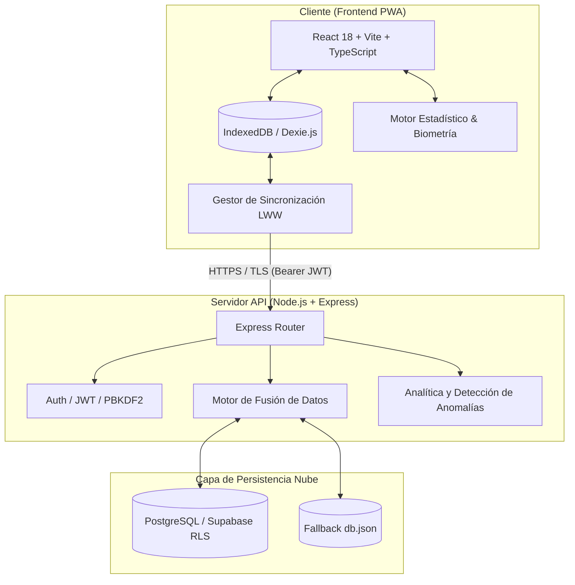

# 01. Arquitectura Técnica y Especificación de Endpoints
### Proyecto Blooma — Acompañamiento Integral para la Mujer

---

## 1. Arquitectura del Sistema

Blooma implementa una **Arquitectura Desacoplada Local-First (Offline-First)**, garantizando que la usuaria pueda registrar síntomas, predecir ciclos menstruales y evaluar signos de alarma obstétricos sin depender de conexión a internet:



---

## 2. Variables de Entorno y Configuración

### Backend (`backend/.env`)
| Variable | Descripción | Obligatoria | Ejemplo |
| :--- | :--- | :---: | :--- |
| `PORT` | Puerto de escucha del servidor Express | Sí | `5000` |
| `JWT_SECRET` | Clave secreta criptográfica para firma de JWT | Sí | `base64url_string_min_48_bytes` |
| `SUPABASE_URL` | URL del proyecto Supabase en la nube | Opcional | `https://xxxx.supabase.co` |
| `SUPABASE_SERVICE_ROLE_KEY` | Llave administrativa de backend Supabase | Opcional | `eyJhbGciOi...` |
| `SUPABASE_ANON_KEY` | Llave anónima pública de Supabase | Opcional | `eyJhbGciOi...` |

### Frontend (`frontend/.env`)
| Variable | Descripción | Obligatoria | Ejemplo |
| :--- | :--- | :---: | :--- |
| `VITE_API_URL` | URL base de la API REST del backend | Sí | `https://proyecto-blooma-api.vercel.app/api` o `http://localhost:5000/api` |

---

## 3. Especificación de Endpoints REST (API Reference)

### 3.1 Módulo de Autenticación (`/api/auth`)

#### `POST /api/auth/register`
Registra un nuevo usuario con contraseña hasheada mediante PBKDF2 (210.000 iteraciones).
* **Headers:** `Content-Type: application/json`
* **Request Body:**
 ```json
 {
 "email": "usuaria@ejemplo.com",
 "password": "MiPasswordSeguro2026!"
 }
 ```
* **Response `201 Created`:**
 ```json
 {
 "message": "Usuario registrado con éxito.",
 "token": "eyJhbGciOiJIUzI1NiIsInR5cCI6IkpXVCJ9...",
 "profile": {
 "stage": "cycle",
 "optInSync": false,
 "pinEnabled": false
 }
 }
 ```

#### `POST /api/auth/login`
Autentica al usuario en tiempo constante (resistente a oráculos de tiempo).
* **Headers:** `Content-Type: application/json`
* **Request Body:**
 ```json
 {
 "email": "usuaria@ejemplo.com",
 "password": "MiPasswordSeguro2026!"
 }
 ```
* **Response `200 OK`:**
 ```json
 {
 "message": "Inicio de sesión exitoso.",
 "token": "eyJhbGciOiJIUzI1NiIsInR5cCI6IkpXVCJ9...",
 "profile": {
 "stage": "cycle",
 "optInSync": true,
 "pinEnabled": false,
 "age": 26
 }
 }
 ```

---

### 3.2 Módulo de Sincronización Bidireccional (`/api/sync`)

#### `POST /api/sync`
Sincroniza en lote ciclos menstruales, registros diarios y triajes usando resolución de conflictos *Last-Write-Wins* (LWW).
* **Headers:** `Authorization: Bearer <token>`, `Content-Type: application/json`
* **Request Body:**
 ```json
 {
 "cycles": [
 {
 "startDate": "2026-07-01",
 "endDate": "2026-07-05",
 "duration": 28,
 "updatedAt": "2026-07-28T14:30:00.000Z"
 }
 ],
 "dailyLogs": [
 {
 "date": "2026-07-28",
 "mood": "calm",
 "flow": "none",
 "pain": "none",
 "temperature": 36.6,
 "updatedAt": "2026-07-28T14:30:00.000Z"
 }
 ],
 "triageRecords": [
 {
 "date": "2026-07-28",
 "gestationWeek": 24,
 "symptoms": ["cefalea_leve"],
 "classification": "vigilar",
 "notes": "Presión arterial normal en control matutino.",
 "updatedAt": "2026-07-28T14:30:00.000Z"
 }
 ]
 }
 ```
* **Response `200 OK`:** Devuelve el estado consolidado de la base de datos para actualizar el cliente.

---

### 3.3 Módulo de Red de Salud y Casas Maternas (`/api/casas-maternas`)

#### `GET /api/casas-maternas?department=Matagalpa`
Consulta el directorio georreferenciado de Casas Maternas y Hospitales con resolución quirúrgica del MINSA.
* **Response `200 OK`:**
  ```json
  [
    {
      "id": 4,
      "name": "Hospital Regional César Amador Molina",
      "department": "Matagalpa",
      "municipality": "Matagalpa",
      "silais": "SILAIS Matagalpa",
      "type": "hospital",
      "phone": "+505 2772 3215",
      "address": "Salida a Managua, frente al Complejo Judicial.",
      "latitude": 12.915200,
      "longitude": -85.929800,
      "has_emergency_24h": true,
      "has_obstetric_surgery": true,
      "has_ambulance": true
    }
  ]
  ```

#### Algoritmo de Proximidad Haversine (Cliente Local-First)
El cálculo de distancia se realiza 100% en el dispositivo del usuario sin consumir datos móviles:
$$\text{distancia} = 2 R \cdot \arcsin\left(\sqrt{\sin^2\left(\frac{\Delta \text{lat}}{2}\right) + \cos(\text{lat}_1)\cos(\text{lat}_2)\sin^2\left(\frac{\Delta \text{lon}}{2}\right)}\right)$$
Donde $R = 6371\text{ km}$. El cliente ordena en tiempo real los 25 establecimientos georreferenciados.

---

### 3.4 Módulo de Inclusión Lingüística Multiétnica y Diversidad Territorial
* **Español Nacional / Comunitario**: Interfaz adaptada al contexto cultural nicaragüense.
* **Miskitu (*Miskitu Yapu*)**: RACCN, Waspam, Río Coco, Bilwi. Alertas vitales y protocolos de Casas Maternas (*Upla Nani Baiki Sakanka*).
* **Nicaraguan Creole English**: RACCS, Bluefields, Corn Island, Laguna de Perlas.

---

### 3.5 Módulo de Evaluación Clínica del Climaterio (Escala MRS - OMS)
* **5 Etapas Fisiológicas (STRAW+10)**: Premenopausia, Perimenopausia Temprana, Perimenopausia Tardía, Menopausia Fisiológica y Postmenopausia.
* **Escala MRS**: 11 ítems distribuidos en 3 subescalas (Somática /16, Psicológica /16, Urogenital /12) con cálculo de severidad clínica (*Leve, Moderada, Severa*).

---

### 3.6 Módulo de Plan de Parto Familiar Comunitario y Control Prenatal
* **Plan de Parto MINSA**: Registro de semana programada de traslado a Casa Materna (Semana 32 - 36), medio de transporte (ambulancia, panga, carreta, vehículo), acompañante responsable y partera comunitaria asignada.
* **Controles Prenatales**: Registro de presión arterial sistólica/diastólica, peso, altura uterina, Frecuencia Cardíaca Fetal (FCF) y suplementación de hierro/ácido fólico.

---

### 3.7 Módulo de Analítica y Detección de Anomalías (`/api/insights`)

#### `GET /api/insights`
Calcula correlaciones de salud, variabilidad de ciclo (desviación típica), interacción sueño-estrés y alertas obstétricas preventivas.
* **Headers:** `Authorization: Bearer <token>`
* **Response `200 OK`:**
 ```json
 {
 "success": true,
 "insights": [
 {
 "id": "cycle_regularity",
 "type": "success",
 "category": "Ciclo",
 "title": "Ritmo del ciclo saludable",
 "message": "Tus registros demuestran un ciclo predecible (variación ±1.2 días).",
 "suggestion": "Sigue registrando tus síntomas diarios."
 }
 ],
 "analyzedAt": "2026-07-28T15:00:00.000Z"
 }
 ```
