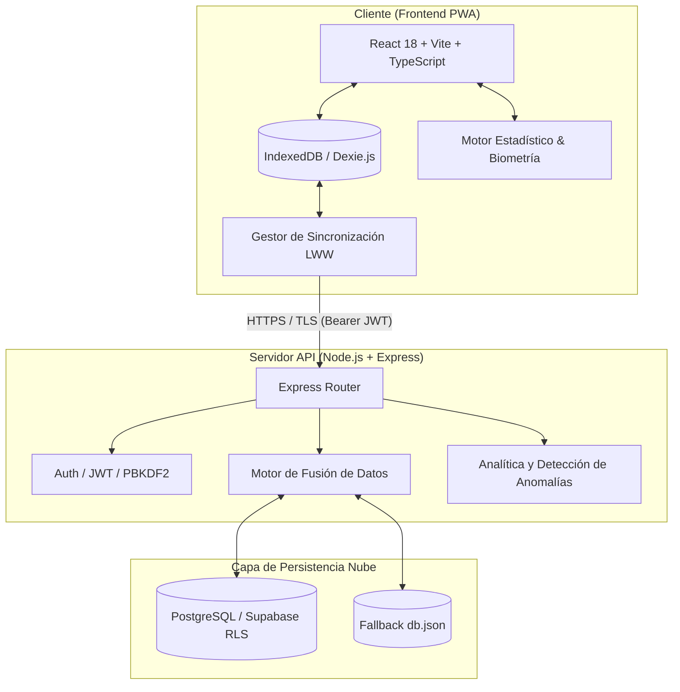

# 01. Arquitectura Técnica y Especificación de Endpoints
### Proyecto Blooma — Acompañamiento Integral para la Mujer

---

## 1. Arquitectura del Sistema

Blooma implementa una **Arquitectura Desacoplada Local-First (Offline-First)**, garantizando que la usuaria pueda registrar síntomas, predecir ciclos menstruales y evaluar signos de alarma obstétricos sin depender de conexión a internet:



---

## 2. Variables de Entorno y Configuración

### Backend (`backend/.env`)
| Variable | Descripción | Obligatoria | Ejemplo |
| :--- | :--- | :---: | :--- |
| `PORT` | Puerto de escucha del servidor Express | Sí | `5000` |
| `JWT_SECRET` | Clave secreta criptográfica para firma de JWT | Sí | `base64url_string_min_48_bytes` |
| `SUPABASE_URL` | URL del proyecto Supabase en la nube | Opcional | `https://xxxx.supabase.co` |
| `SUPABASE_SERVICE_ROLE_KEY` | Llave administrativa de backend Supabase | Opcional | `eyJhbGciOi...` |
| `SUPABASE_ANON_KEY` | Llave anónima pública de Supabase | Opcional | `eyJhbGciOi...` |

### Frontend (`frontend/.env`)
| Variable | Descripción | Obligatoria | Ejemplo |
| :--- | :--- | :---: | :--- |
| `VITE_API_URL` | URL base de la API REST del backend | Sí | `https://proyecto-blooma-api.vercel.app/api` o `http://localhost:5000/api` |

---

## 3. Especificación de Endpoints REST (API Reference)

### 3.1 Módulo de Autenticación (`/api/auth`)

#### `POST /api/auth/register`
Registra un nuevo usuario con contraseña hasheada mediante PBKDF2 (210.000 iteraciones).
* **Headers:** `Content-Type: application/json`
* **Request Body:**
 ```json
 {
 "email": "usuaria@ejemplo.com",
 "password": "MiPasswordSeguro2026!"
 }
 ```
* **Response `201 Created`:**
 ```json
 {
 "message": "Usuario registrado con éxito.",
 "token": "eyJhbGciOiJIUzI1NiIsInR5cCI6IkpXVCJ9...",
 "profile": {
 "stage": "cycle",
 "optInSync": false,
 "pinEnabled": false
 }
 }
 ```

#### `POST /api/auth/login`
Autentica al usuario en tiempo constante (resistente a oráculos de tiempo).
* **Headers:** `Content-Type: application/json`
* **Request Body:**
 ```json
 {
 "email": "usuaria@ejemplo.com",
 "password": "MiPasswordSeguro2026!"
 }
 ```
* **Response `200 OK`:**
 ```json
 {
 "message": "Inicio de sesión exitoso.",
 "token": "eyJhbGciOiJIUzI1NiIsInR5cCI6IkpXVCJ9...",
 "profile": {
 "stage": "cycle",
 "optInSync": true,
 "pinEnabled": false,
 "age": 26
 }
 }
 ```

---

### 3.2 Módulo de Sincronización Bidireccional (`/api/sync`)

#### `POST /api/sync`
Sincroniza en lote ciclos menstruales, registros diarios y triajes usando resolución de conflictos *Last-Write-Wins* (LWW).
* **Headers:** `Authorization: Bearer <token>`, `Content-Type: application/json`
* **Request Body:**
 ```json
 {
 "cycles": [
 {
 "startDate": "2026-07-01",
 "endDate": "2026-07-05",
 "duration": 28,
 "updatedAt": "2026-07-28T14:30:00.000Z"
 }
 ],
 "dailyLogs": [
 {
 "date": "2026-07-28",
 "mood": "calm",
 "flow": "none",
 "pain": "none",
 "temperature": 36.6,
 "updatedAt": "2026-07-28T14:30:00.000Z"
 }
 ],
 "triageRecords": [
 {
 "date": "2026-07-28",
 "gestationWeek": 24,
 "symptoms": ["cefalea_leve"],
 "classification": "vigilar",
 "notes": "Presión arterial normal en control matutino.",
 "updatedAt": "2026-07-28T14:30:00.000Z"
 }
 ]
 }
 ```
* **Response `200 OK`:** Devuelve el estado consolidado de la base de datos para actualizar el cliente.

---

### 3.3 Módulo de Directorio de Casas Maternas (`/api/casas-maternas`)

#### `GET /api/casas-maternas?department=Matagalpa`
Consulta el directorio geolocalizado de Casas Maternas de la red nacional del MINSA.
* **Response `200 OK`:**
 ```json
 [
 {
 "id": 1,
 "name": "Casa Materna Gladys Marín",
 "department": "Matagalpa",
 "municipality": "Matagalpa",
 "phone": "+505 2772 2012",
 "address": "De la Catedral 2 cuadras al norte, 1 cuadra al este."
 }
 ]
 ```

---

### 3.4 Módulo de Analítica y Detección de Anomalías (`/api/insights`)

#### `GET /api/insights`
Calcula correlaciones de salud, variabilidad de ciclo (desviación típica), interacción sueño-estrés y alertas obstétricas preventivas.
* **Headers:** `Authorization: Bearer <token>`
* **Response `200 OK`:**
 ```json
 {
 "success": true,
 "insights": [
 {
 "id": "cycle_regularity",
 "type": "success",
 "category": "Ciclo",
 "title": "Ritmo del ciclo saludable",
 "message": "Tus registros demuestran un ciclo predecible (variación ±1.2 días).",
 "suggestion": "Sigue registrando tus síntomas diarios."
 }
 ],
 "analyzedAt": "2026-07-28T15:00:00.000Z"
 }
 ```
