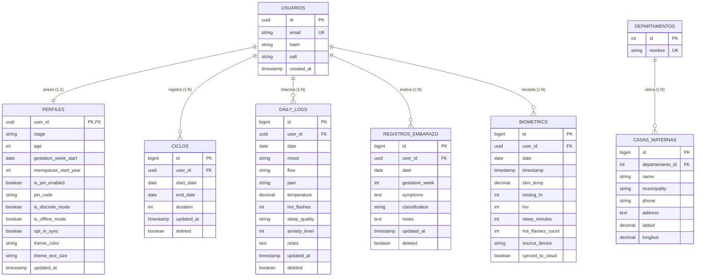

# 02. Diagrama Entidad-Relación Normalizado (3FN) y Diccionario de Datos
### Proyecto Blooma — Base de Datos Relacional y Offline

---

## 1. Diagrama Entidad-Relación (ERD) en 3ª Forma Normal (3FN)

El modelo de datos de Blooma ha sido normalizado eliminando dependencias transitivas y parciales para garantizar la integridad referencial y optimizar la sincronización offline-first:

---

## 2. Justificación de Normalización (Tercera Forma Normal - 3FN)

1. **Primera Forma Normal (1FN):**
 * Todos los atributos contienen valores atómicos indivisibles. No existen grupos repetitivos ni columnas multivaluadas compuestas.
2. **Segunda Forma Normal (2FN):**
 * El modelo cumple 1FN y cada atributo que no forma parte de la clave primaria depende por completo y de forma directa de la clave primaria completa (`user_id`, `id`).
3. **Tercera Forma Normal (3FN):**
 * No existen dependencias transitivas (ningún atributo no clave depende de otro atributo no clave). Por ejemplo, los datos geográficos departamentales están desacoplados en entidades independientes (`DEPARTAMENTOS` → `CASAS_MATERNAS`), evitando anomalías de inserción, actualización o borrado.

---

## 3. Diccionario de Datos

### Tabla: `perfiles`
| Campo | Tipo | Nulo | Descripción |
| :--- | :--- | :---: | :--- |
| `user_id` | `UUID` | No | Clave foránea referenciando a `usuarios.id` (PK). |
| `stage` | `VARCHAR(20)` | No | Etapa actual: `'cycle'`, `'pregnancy'`, `'menopause'`. |
| `age` | `INTEGER` | Sí | Edad de la usuaria en años cumplidos. |
| `gestation_week_start`| `DATE` | Sí | Fecha de última menstruación (FUM) o inicio gestacional. |
| `is_pin_enabled` | `BOOLEAN` | No | Bandera de bloqueo de aplicación mediante PIN de 4 dígitos. |
| `is_discrete_mode` | `BOOLEAN` | No | Modo discreto de camuflaje de términos para prevención de IPV. |
| `opt_in_sync` | `BOOLEAN` | No | Consentimiento explícito para respaldo en la nube. |

### Tabla: `ciclos`
| Campo | Tipo | Nulo | Descripción |
| :--- | :--- | :---: | :--- |
| `id` | `BIGINT` | No | Identificador único autoincremental (PK). |
| `user_id` | `UUID` | No | Clave foránea a la usuaria propietaria. |
| `start_date` | `DATE` | No | Fecha de inicio del sangrado menstrual (YYYY-MM-DD). |
| `end_date` | `DATE` | Sí | Fecha de finalización del sangrado. |
| `duration` | `INTEGER` | Sí | Duración total del ciclo en días calculada por el motor. |
| `updated_at` | `TIMESTAMPTZ` | No | Marca temporal para resolución de conflictos LWW. |

### Tabla: `registros_embarazo` (Triaje Clínico)
| Campo | Tipo | Nulo | Descripción |
| :--- | :--- | :---: | :--- |
| `id` | `BIGINT` | No | Identificador del registro de triaje (PK). |
| `user_id` | `UUID` | No | Clave foránea a la usuaria. |
| `gestation_week` | `INTEGER` | No | Semana de embarazo calculada al momento del reporte. |
| `symptoms` | `TEXT` | No | Lista codificada de síntomas experimentados. |
| `classification` | `VARCHAR(20)` | No | Nivel de triaje: `'normal'`, `'vigilar'`, `'urgente'`. |
