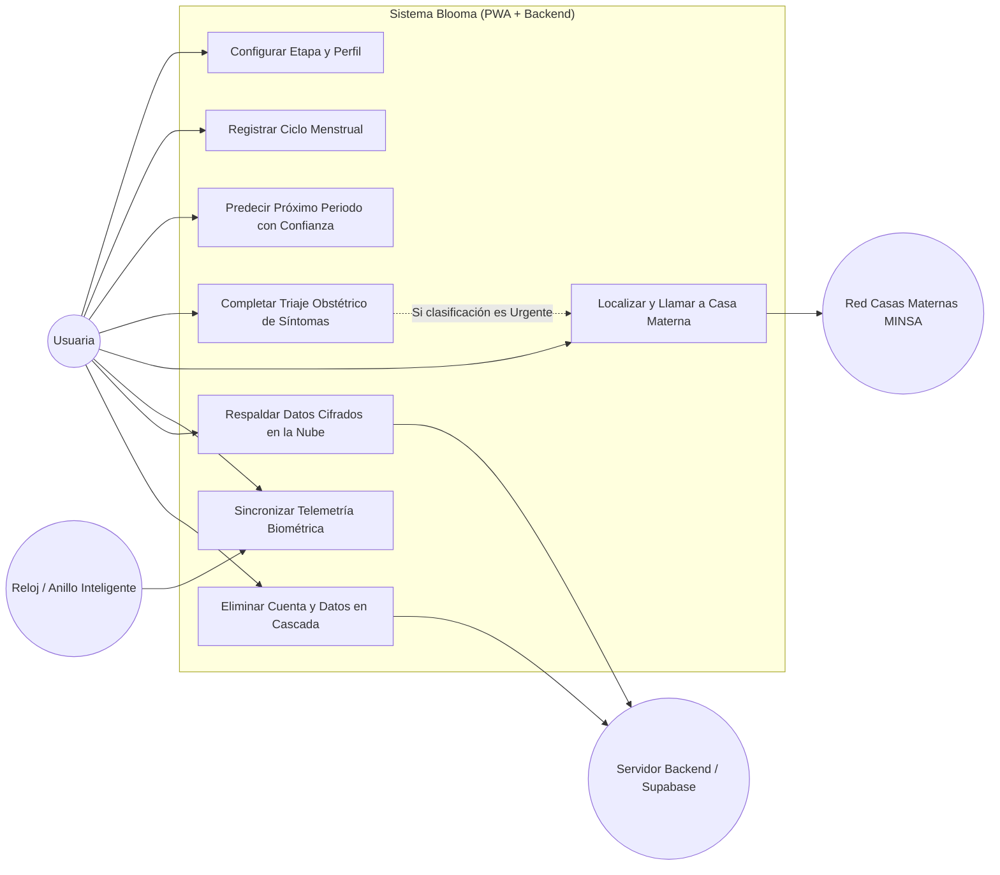
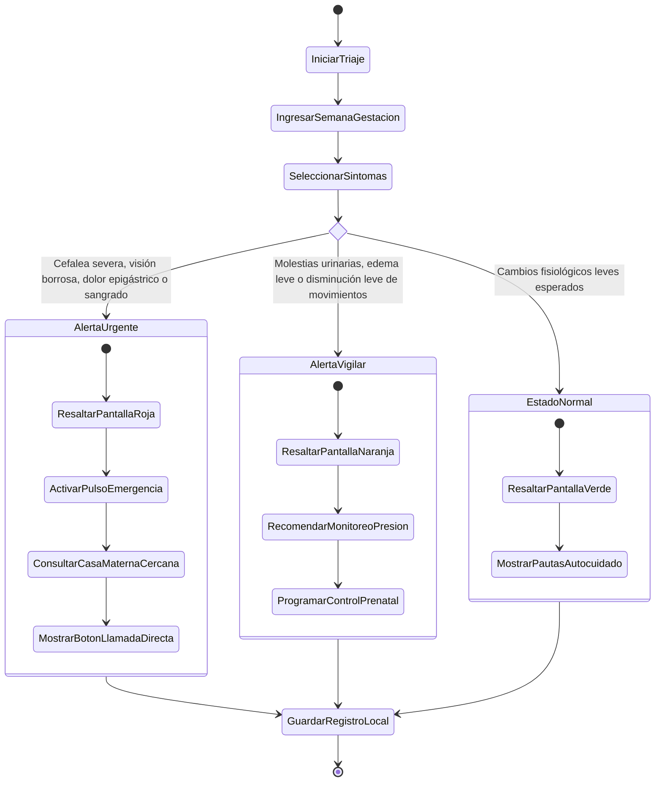
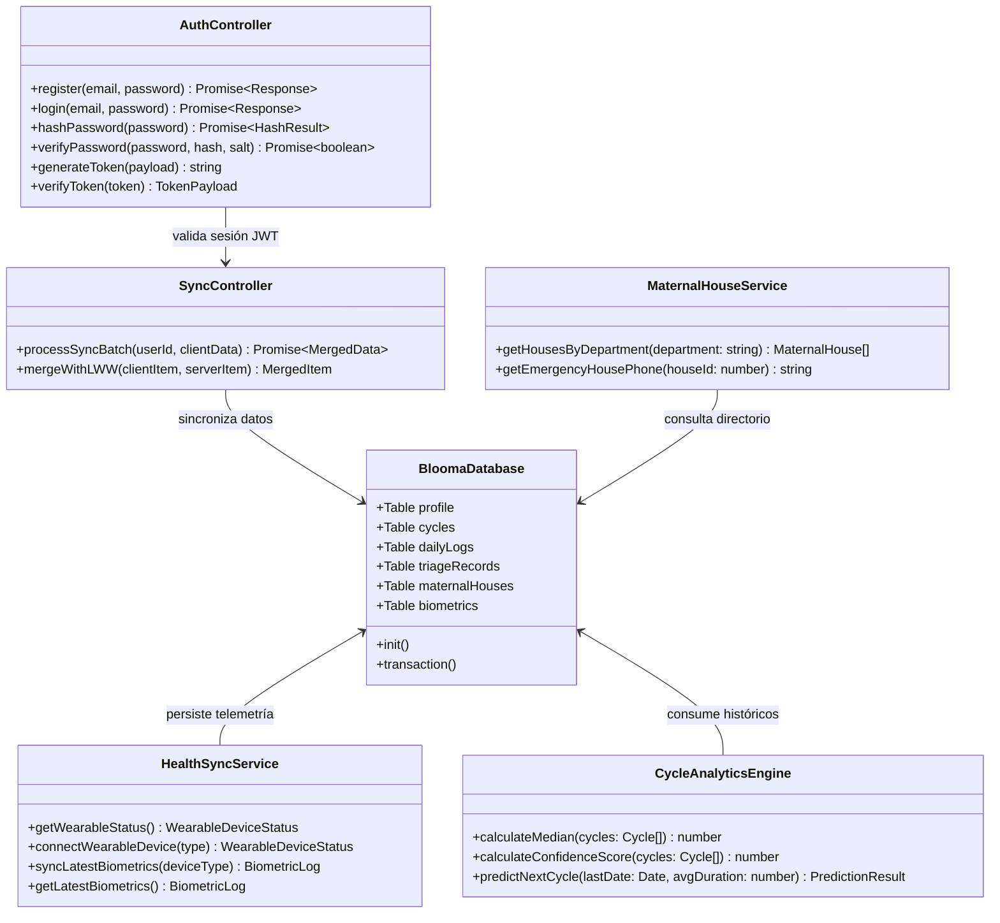

# 03. Diagramas UML del Sistema (Casos de Uso, Actividades y Clases)
### Proyecto Blooma — Especificación de Modelado de Software

---

## 1. Diagrama de Casos de Uso (UML Use Case Diagram)

Representa las interacciones entre los actores del sistema (Usuaria, Motor de Telemetría Wearable, Servidor API y Red de Casas Maternas MINSA):

---

## 2. Diagrama de Actividades (UML Activity Diagram)
### Flujo: Evaluación y Triaje Obstétrico de Síntomas de Alarma

Muestra el proceso de toma de decisiones clínicas ante la presencia de signos de peligro en el embarazo:

---

## 3. Diagrama de Clases (UML Class Diagram)

Estructura orientada a objetos del frontend y backend de Blooma:

