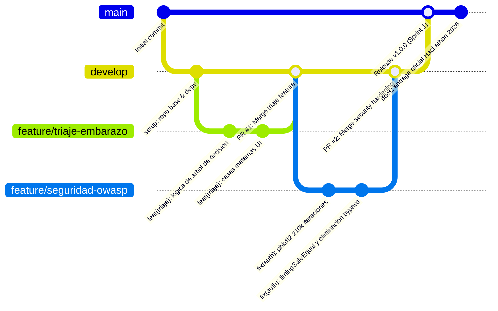

# 04. Flujo de Control de Versiones en Git y Convenciones
### Proyecto Blooma — Estándar de Colaboración Técnica

---

## 1. Estrategia de Ramas (GitFlow Adaptado)

Para asegurar la trazabilidad del código y evitar conflictos en el despliegue a producción, el equipo utiliza el flujo estructurado:

---

## 2. Estándar de Conventional Commits

Todos los mensajes de confirmación siguen la especificación semántica: `<tipo>(<alcance>): <descripción>`

### Tipos Permitidos:
* **`feat`**: Nueva funcionalidad para la usuaria (ej. `feat(wearables): conectar telemetria de reloj inteligente`).
* **`fix`**: Corrección de un error o vulnerabilidad (ej. `fix(auth): prevenir oraculo de tiempo en login`).
* **`docs`**: Cambios exclusivos en documentación (ej. `docs(erd): actualizar diagrama 3FN`).
* **`style`**: Ajustes visuales o de formato que no afectan la lógica (ej. `style(theme): mejorar contraste WCAG AA`).
* **`refactor`**: Reestructuración de código sin alterar comportamiento (ej. `refactor(db): modularizar indices Dexie`).
* **`test`**: Pruebas automatizadas o manuales documentadas.

---

## 3. Política de Pull Requests (PR) y Code Review

1. Ningún cambio directo en la rama `main`.
2. Las ramas de características (`feature/*`) se fusionan a `develop` mediante Pull Request con revisión de al menos un integrante del equipo técnico.
3. Se verifica que el build de Vite (`npm run build`) no arroje errores de compilación ni TypeScript antes de aprobar el PR.
