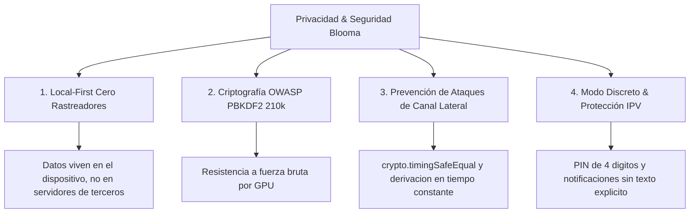
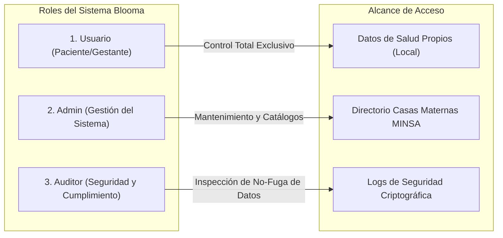

# 05. Seguridad, Buenas Prácticas y Roles de Acceso
### Proyecto Blooma — Privacidad por Diseño y Control de Permisos

---

## 1. Pilares de Seguridad Implementados

---

## 2. Mitigación de Vulnerabilidades de la Competencia

| Falla Documentada en Apps Existentes | Caso Real | Solución Verificable en Blooma |
| :--- | :--- | :--- |
| **Venta de datos a redes publicitarias** | Flo Health (demanda Meta, 2025) | Arquitectura Local-First: cero SDKs de publicidad ni analítica de terceros. |
| **Vulnerabilidad ante órdenes judiciales** | Ovia / Apps en la nube | Si la usuaria no sincroniza, los datos no existen en ningún servidor. |
| **Vigilancia de Pareja (IPV)** | Reportes Privacy International | Modo discreto con camuflaje de términos + PIN de 4 dígitos. |
| **Retención indefinida de datos** | Auditorías GDPR | Botón de eliminación efectiva en cascada (IndexedDB + Supabase). |
| **Falsos positivos/negativos en triaje** | Apps genéricas | Árbol clínico conservador: ante duda, el sistema escala de nivel. |

---

## 3. Matriz de Roles y Permisos de Seguridad (RBAC)

Para garantizar la integridad del sistema y la estricta privacidad de la información médica, Blooma define **3 roles fundamentales** con permisos diferenciados:

### Detalle de Permisos por Rol:

| Módulo / Función | Rol: Usuario | Rol: Admin | Rol: Auditor | Justificación Técnica |
| :--- | :---: | :---: | :---: | :--- |
| **Registro de Síntomas y Ciclo** | Total (Crear / Leer / Editar / Borrar) | Denegado | Denegado | Privacidad médica absoluta: los registros íntimos nunca son visibles para el personal administrativo ni auditores. |
| **Configuración de PIN y Modo Discreto** | Permitido | Denegado | Denegado | Control exclusivo de la usuaria en su dispositivo local. |
| **Exportación de Reporte Clínico PDF** | Permitido | Denegado | Denegado | Generado localmente en el cliente mediante pdfMake sin subir a servidores. |
| **Gestión de Directorio de Casas Maternas** | Solo Lectura / Llamada | Total (CRUD) | Solo Lectura | El Administrador actualiza teléfonos, contactos y ubicaciones de la red MINSA. |
| **Parámetros Clínicos Globales** | Solo Lectura | Total | Solo Lectura | Parámetros de referencia médica basados en normas técnicas oficiales del MINSA. |
| **Inspección de Logs de Seguridad** | Denegado | Solo Lectura | Total | El Auditor verifica que no existan fugas de datos, intentos de inyección ni rastreadores. |
| **Auditoría Criptográfica PBKDF2** | Denegado | Denegado | Total | Verificación de funciones en tiempo constante y solidez de claves sin acceso a datos en claro. |

---

## 4. Evidencia Visual de Privacidad y Ajustes en Producción

Las siguientes pantallas demuestran la interfaz de seguridad y control de privacidad disponible para la usuaria:

* **Modo Privado Off-Grid y PIN de Seguridad:** [19_ajustes_privacidad_offgrid_pin_desktop.png](file:///home/espinozaisaac/proyectos/Proyecto-Blooma/entregables_hackathon/assets/19_ajustes_privacidad_offgrid_pin_desktop.png)
* **Objetivos de Salud, Wearables y Modo Discreto:** [20_ajustes_objetivo_modo_discreto_desktop.png](file:///home/espinozaisaac/proyectos/Proyecto-Blooma/entregables_hackathon/assets/20_ajustes_objetivo_modo_discreto_desktop.png)
* **Ajustes de Privacidad en Móvil:** [21_ajustes_privacidad_mobile.png](file:///home/espinozaisaac/proyectos/Proyecto-Blooma/entregables_hackathon/assets/21_ajustes_privacidad_mobile.png)
