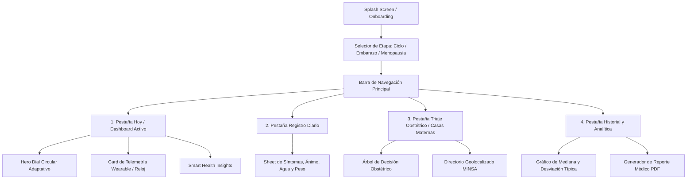

# 05. Experiencia de Usuario (UX), Wireframes y Mockups
### Proyecto Blooma — Arquitectura de Información y Bocetos de Interfaz

---

## 1. Arquitectura de Información y Flujo de Navegación

Blooma organiza su experiencia en torno a 4 pilares de navegación fijos y un menú lateral de configuración:



---

## 2. Wireframes Estructurales de Baja Fidelidad (Bocetos)

Los wireframes fueron diseñados respetando estrictamente las relaciones de aspecto estándar para dispositivos móviles (**9:16** / 390 × 844 px) y pantallas de escritorio (**16:9**):

### Wireframe 1: Vista Móvil (Aspect Ratio 9:16)
```
┌───────────────────────────────────────┐  ▲
│ [≡] BLOOMA             [Off-Grid ●]   │  │
├───────────────────────────────────────┤  │
│  Selector de Etapa:                   │  │
│  [ (●) Ciclo  ( ) Embarazo  ( ) Meno] │  │
├───────────────────────────────────────┤  │ Relación de Aspecto
│                                       │  │ 9:16 (Móvil Vertical)
│            ╭──────────────╮           │  │ 390 x 844 px
│          ╭─┤ DÍA 14 / 28  ├─╮         │  │
│         │  │ 85% Confiab. │  │        │  │
│         │  │ FASE FÉRTIL  │  │        │  │
│          ╰─┤  Ovulación   ├─╯         │  │
│            ╰──────────────╯           │  │
│                                       │  │
├───────────────────────────────────────┤  │
│ [ Smart Insights: Estás en pico LH  ] │  │
│ [ Telemetría Reloj: 36.57°C / 72 lpm] │  │
├───────────────────────────────────────┤  │
│  [ Hoy ]    [ + Registrar ]   [ Guía] │  │
└───────────────────────────────────────┘  ▼
```

### Wireframe 2: Vista de Escritorio (Aspect Ratio 16:9)
```
┌─────────────────────────────────────────────────────────────────────────────┐
│ [Logo Blooma]   Dashboard   |   Historial   |   Casas Maternas   |  [Ajustes] │
├──────────────────────────────┬──────────────────────────────────────────────┤
│ COLUMNA IZQUIERDA (Dial)     │ COLUMNA DERECHA (Analítica & Guías)          │
│                              │                                              │
│      ╭──────────────╮        │  ┌────────────────────────────────────────┐  │
│     │ DÍA 14 / 28   │        │  │ Gráfico Hormonal: Estrógeno/Progesterona│  │
│     │ FASE FÉRTIL   │        │  └────────────────────────────────────────┘  │
│      ╰──────────────╯        │                                              │
│                              │  ┌────────────────────────────────────────┐  │
│ [ Selector Rápido de Etapa ] │  │ Triaje Obstétrico: Casas Maternas MINSA│  │
│ [ Registro Rápido Síntomas ] │  └────────────────────────────────────────┘  │
└──────────────────────────────┴──────────────────────────────────────────────┘
```

---

## 3. Catálogo de Mockups y Pantallas Reales en Producción

Las siguientes interfaces demuestran la implementación funcional de alta fidelidad:

1. **Dashboard Principal de Ciclo:** [01_dashboard_hero_dial.png](file:///home/espinozaisaac/proyectos/Proyecto-Blooma/entregables_hackathon/assets/01_dashboard_hero_dial.png)
2. **Vista de Escritorio y Curvas Hormonales:** [02_dashboard_desktop_view.png](file:///home/espinozaisaac/proyectos/Proyecto-Blooma/entregables_hackathon/assets/02_dashboard_desktop_view.png)
3. **Bitácora de Registro Diario:** [03_registro_diario_mobile.png](file:///home/espinozaisaac/proyectos/Proyecto-Blooma/entregables_hackathon/assets/03_registro_diario_mobile.png)
4. **Módulo de Embarazo y Triaje MINSA:** [07_embarazo_fetal_dial.png](file:///home/espinozaisaac/proyectos/Proyecto-Blooma/entregables_hackathon/assets/07_embarazo_fetal_dial.png)
5. **Directorio de Casas Maternas:** [10_embarazo_directorio_casas_maternas.png](file:///home/espinozaisaac/proyectos/Proyecto-Blooma/entregables_hackathon/assets/10_embarazo_directorio_casas_maternas.png)
6. **Módulo de Menopausia y Confort Térmico:** [15_menopausia_bienestar_dial_mobile.png](file:///home/espinozaisaac/proyectos/Proyecto-Blooma/entregables_hackathon/assets/15_menopausia_bienestar_dial_mobile.png)
7. **Ajustes de Privacidad y PIN Local:** [21_ajustes_privacidad_mobile.png](file:///home/espinozaisaac/proyectos/Proyecto-Blooma/entregables_hackathon/assets/21_ajustes_privacidad_mobile.png)
