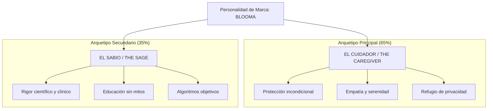

# 03. Plan de Branding y Arquetipos de Marca
### Proyecto Blooma — Identidad Estratégica y Alma del Producto

---

## 1. Arquetipos de Marca: El Alma de Blooma

La personalidad de Blooma se construye sobre una combinación dual de arquetipos junguianos:

* **El Cuidador (*The Caregiver*):** Brinda un espacio seguro, cálido y confidencial. Protege a la usuaria contra la invasión de su privacidad y la acompaña con respeto ante el dolor o la incertidumbre.
* **El Sabio (*The Sage*):** Entrega conocimiento riguroso, porcentajes de confianza estadística y protocolos médicos validados por el MINSA/OMS, sin prometer falsos milagros.

---

## 2. Coherencia Estratégica en Canales y Pantallas

| Componente del Sistema | Cómo se refleja el Arquetipo Cuidador | Cómo se refleja el Arquetipo Sabio |
| :--- | :--- | :--- |
| **Hero Dial del Ciclo** | Colores suaves y mensajes que no juzgan la irregularidad. | Muestra la desviación estándar real y el puntaje de confianza. |
| **Triaje de Embarazo** | Botón de llamada directa y contacto con Casas Maternas. | Árbol de decisión basado en guías obstétricas de la OMS. |
| **Gestión de Datos** | Modo discreto con PIN para protegerla en su hogar. | Transparencia total en el almacenamiento local sin rastreadores. |
| **Módulo Menopausia** | Herramientas interactivas para alivio de sofocos y ansiedad. | Información sobre chequeos de densidad ósea y osteoporosis. |
