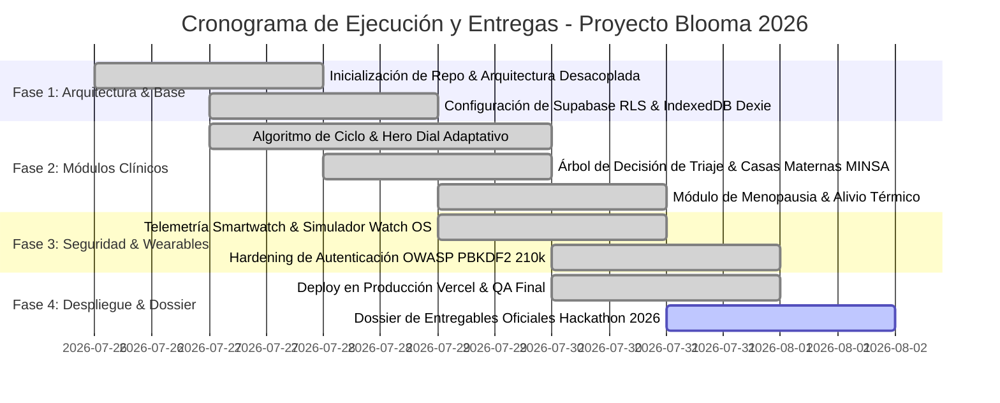

# 05. Objetivos SMART y Cronograma Secuencial de Entrega
### Proyecto Blooma — Planificación Estratégica y Tiempos de Ejecución

---

## 1. Los 4 Objetivos SMART de Blooma

1. **Objetivo Técnico (Despliegue & Offline):**
 * *Específico:* Desarrollar y desplegar una PWA con soporte 100% offline (IndexedDB), tiempo de carga inicial menor a 1.2 segundos y cifrado PBKDF2 de 210k iteraciones.
 * *Medible:* 100% de cumplimiento en pruebas de modo avión y puntuación Lighthouse > 90 en accesibilidad y rendimiento.
 * *Alcanzable:* Utilizando React 18, Vite, Dexie.js y Vercel Edge Network.
 * *Relevante:* Garantiza acceso ininterrumpido para mujeres en zonas rurales de Nicaragua sin internet.
 * *Temporal:* Completado y verificado antes del 31 de Julio de 2026.

2. **Objetivo de Salud Pública (Cobertura Institucional MINSA):**
 * *Específico:* Georreferenciar e integrar en el módulo de triaje obstétrico las 8 Casas Maternas principales de las cabeceras departamentales del país.
 * *Medible:* 8 departamentos con nombre, dirección, coordenadas y número telefónico verificado de llamada directa.
 * *Alcanzable:* Mediante los datos oficiales provistos por la red del MINSA.
 * *Relevante:* Reduce la morbimortalidad materna al facilitar atención temprana en emergencias obstétricas.
 * *Temporal:* Integrado y sembrado en base de datos para el Sprint 1 (Julio 2026).

3. **Objetivo de Accesibilidad & Inclusión (Diseño UI/UX):**
 * *Específico:* Diseñar 4 temas cromáticos con validación formal de ratio de contraste WCAG AA (mínimo 4.5:1) y modo de lectura aumentada (+15% tipografía).
 * *Medible:* Cero errores de contraste en auditoría axe DevTools y Google Lighthouse.
 * *Alcanzable:* Utilizando variables CSS y paletas HSL tailoring en Tailwind CSS.
 * *Relevante:* Permite el uso a mujeres con debilidad visual o adultas mayores en menopausia.
 * *Temporal:* Validado y documentado para la entrega final del Hackathon.

4. **Objetivo de Adopción e Impacto Comunitario:**
 * *Específico:* Alcanzar un piloto inicial de 100 usuarias activas en la comunidad universitaria UNI y centros de salud aliados, recopilando retroalimentación de usabilidad.
 * *Medible:* 100 registros locales anónimos y 0 reportes de filtración de datos.
 * *Alcanzable:* Mediante talleres de salud digital y código abierto.
 * *Relevante:* Valida el producto en condiciones reales de uso.
 * *Temporal:* Plazo de ejecución de 60 días posteriores a la fase de evaluación.

---

## 2. Cronograma Secuencial de Ejecución (Diagrama de Gantt)

