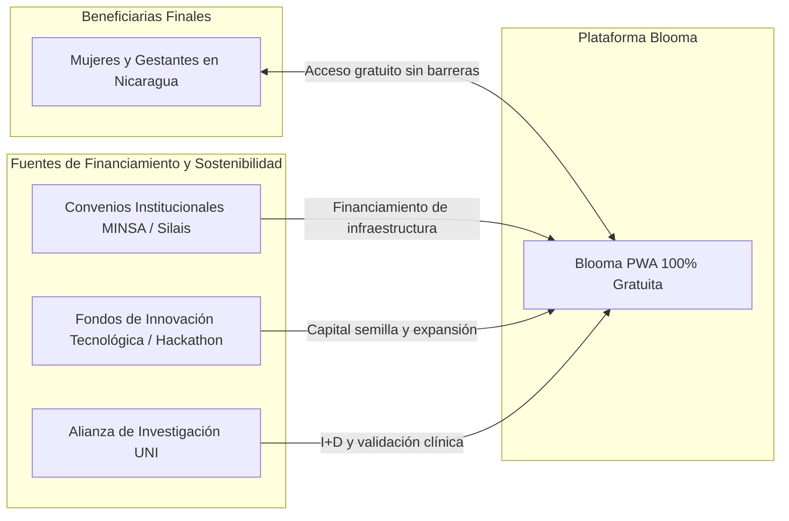

# 06. Plan Financiero, Modelo de Sostenibilidad y Presupuesto
### Proyecto Blooma — Viabilidad Económica e Impacto Social

---

## 1. Modelo de Sostenibilidad y Propuesta de Valor Diferenciada

Blooma opera bajo un **Modelo Híbrido de Impacto Social (B2G / Cooperación Técnica)**:

* **Acceso Gratuito e Irrestricto:** La usuaria final jamás paga por descargar la app, registrarse o acceder a funciones de triaje de emergencia.
* **Ahorro para el Sistema Público:** La detección temprana de complicaciones obstétricas reduce los costos de hospitalización en cuidados intensivos y traslados de urgencia para el MINSA.

---

## 2. Presupuesto Operativo Anual (Fase Piloto y Despliegue)

| Rubro / Concepto | Detalle Técnico | Costo Mensual (USD) | Costo Anual (USD) |
| :--- | :--- | :---: | :---: |
| **Infraestructura Cloud (Vercel Edge)** | Alojamiento global de PWA y SSL | $0.00 *(Tier Pro Hackathon)* | $0.00 |
| **Base de Datos & Auth (Supabase)** | PostgreSQL gestionado con RLS | $0.00 *(Free / Open Source)* | $0.00 |
| **Dominio Oficial (`.ni` / `.app`)** | Dominio personalizado institucional | $2.50 | $30.00 |
| **Material Impreso de Difusión** | Afiches informativos para 8 Casas Maternas | — | $120.00 |
| **Capacitación a Promotoras de Salud**| Talleres de inducción comunitaria | — | $150.00 |
| **Mantenimiento y Soporte Técnico** | Equipo voluntario UNI / Horas técnicas | In-kind (Alianza UNI) | In-kind |
| **TOTAL PRESUPUESTO AÑO 1** | **Costos de operación optimizados** | **~$2.50 / mes** | **$300.00 USD** |

---

## 3. Presupuesto de Marketing y Difusión Digital (6 Meses)

| Canal / Estrategia | Actividad Específica | Presupuesto Asignado | Meta de Alcance |
| :--- | :--- | :---: | :---: |
| **Campaña Digital en Redes** | Microcampañas geolocalizadas (Instagram/TikTok) | $80.00 | 25,000 impresiones |
| **Material Gráfico Puntos MINSA** | Códigos QR impresos en salas de espera | $70.00 | 5,000 contactos directos |
| **Stands en Ferias Tecnológicas** | Demostración en vivo de telemetría wearable | $50.00 | 500 pruebas guiadas |
| **TOTAL MARKETING** | **Estrategia austera de alto impacto** | **$200.00 USD** | **> 30,000 mujeres alcanzadas** |
